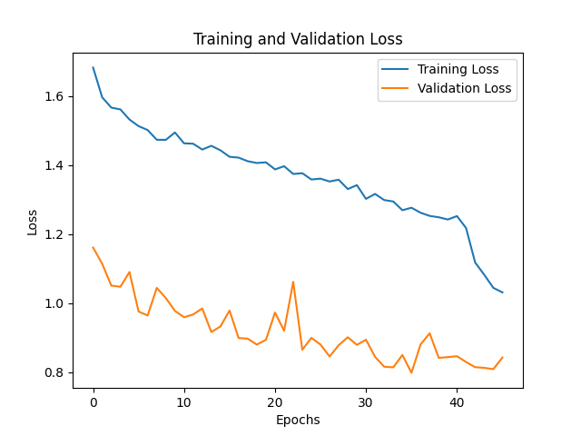
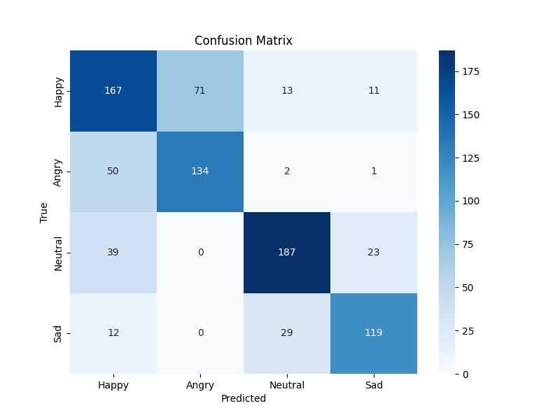

# Emotion Recognition Using Speech Data

This project is part of an academic research effort conducted during a Master's program (Master 2: Functional Data and Deep Learning). Its purpose is to recognize emotions in speech, with a focus on four specific emotions: anger, joy, neutrality, and sadness.

## Overview

The aim of this project is to classify human emotions based on voice data. The dataset consists of mel-spectrogram representations of speech recordings, targeting the following emotions: **Angry**, **Happy**, **Neutral**, and **Sad**.

The project utilized the PyTorch framework for training and evaluation, with data augmentation techniques applied to improve model performance.

## Dataset

The dataset is composed of voice recordings that reflect specific emotions:

- **Angry**
- **Happy**
- **Neutral**
- **Sad**

The data was provided by our supervisor, Mr. Matthieu Saumard, and served as the foundation for this research.

## Model Architecture

The model architecture combines several deep learning techniques, including:

1. **Data Augmentation**: Techniques such as width shifting, zooming, and horizontal flipping were applied to the mel-spectrograms using `ImageDataGenerator` from TensorFlow/Keras.
2. **Feedforward Neural Networks (FFNN)**: FFNN layers were employed to process individual feature maps.
3. **LSTM Layer**: A Long Short-Term Memory (LSTM) layer was used to manage the sequential nature of mel-spectrogram frames.
4. **Transformer Encoder**: A Transformer-based encoder captured complex relationships within the data.
5. **AdaFNN Layer**: Custom layers were created to handle multi-dimensional feature combinations.
6. **CrossEntropy Loss**: Used as the loss function for multi-class classification.

## Training Procedure

- The model was trained using the Adam optimizer with a learning rate of 0.001.
- Early stopping was applied with a patience of 10 epochs.
- The best model, based on validation loss, was saved as `best_model.pth`.
- The model was trained for a total of 100 epochs.

The following chart illustrates the training and validation loss during model training:



## Evaluation

The trained model was evaluated on a test dataset. Below are the results, including the confusion matrix and classification report:

### Confusion Matrix



### Classification Report

```
              precision    recall  f1-score   support

       Happy       0.62      0.64      0.63       262
       Angry       0.65      0.72      0.68       187
     Neutral       0.81      0.75      0.78       249
         Sad       0.77      0.74      0.76       160

    accuracy                           0.71       858
   macro avg       0.71      0.71      0.71       858
weighted avg       0.71      0.71      0.71       858
```

## Model Files

You can download the pre-trained model files from the following links:

- [Best Model (`best_model.pth`)](https://drive.google.com/file/d/1ToMZsxIB3q1Pzxy4hkQ4iDQm2xAMZ93Q/view?usp=share_link)
- [Final Model (`emotion_recognition_model.pth`)](https://drive.google.com/file/d/1lItam4XH5Fucodwxn-dAe4w0B5AFNtkg/view?usp=share_link)

## How to Use

To use the pre-trained model or train the model from scratch:

1. Clone the repository:
   ```bash
   git clone https://github.com/papelearningml/emotion-recognition.git
   ```
2. Download the pre-trained model files from the provided links.
3. Run the `train_model.ipynb` notebook to train the model or use the pre-trained models for evaluation.

## Conclusion

This project successfully demonstrates the use of deep learning techniques to recognize emotions from speech data. By combining LSTM and Transformer architectures with effective data augmentation strategies, we achieved a balanced accuracy of 71% across the four target emotions. The work done here can serve as a stepping stone for further advancements in emotion recognition systems based on speech.
